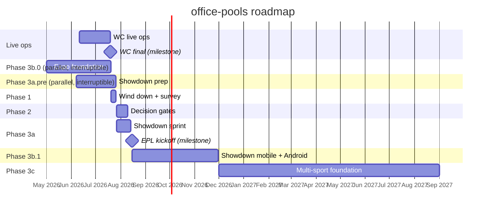

# Project Activities Repository

Single source of truth for the office-pools project: **roadmap**, **backlog**, **tech debt**, and **risks & dependencies**. One-stop shop for all project state. Updated May 2026. Owner: Ryan Sousa.

## How to use this doc

- **§1 Roadmap** — phased plan with timeline anchors and the strategic sequencing decision.
- **§2 Backlog** — index of every deferred work item. Detail for each lives in `memory/project_backlog_*.md` — keep that as the long-form home; this doc keeps the index.
- **§3 Tech debt** — known debt today, annotated with the roadmap phase that clears it.
- **§4 Risks & dependencies** — external constraints, deadlines, and blockers, each with a mitigation.
- **§5 Open questions** — unresolved decisions to settle in Phase 2.

When the project state changes (roadmap reshuffle, new backlog item, debt resolved, risk materialised), update this doc. New long-form backlog entries go into a `memory/project_backlog_*.md` file and get indexed here.

> **🔴 ACTIVE (live ops, 2026-06-25):** Off-XL + egress remediation is being executed from
> **`SCALE_PLAN.md`** (repo root) — the gated, self-auditing execution doc for the caching →
> read-model → realtime work. That is the working reference for this change. Root cause: per-view
> recompute pulling raw predictions (6.7M calls / ~89 hrs DB CPU) drives both XL **and** the 86% PostgREST egress.

---

# 1. Roadmap

Strategic plan for work to be picked up once the FIFA World Cup 2026 product cycle wraps.

## Timeline anchors

- **World Cup final:** Jul 19, 2026
- **Post-tournament window:** Jul 20 – Aug 14, 2026 (~4 weeks)
- **EPL 2026/27 kickoff:** Aug 15, 2026 — only hard external deadline



The ~4-week gap between WC final and EPL kickoff is the entire planning constraint. Either Showdown ships for EPL Aug 2026 or it slips to the following season.

## Phase 1 — Wind down (within 1 week of WC final)

Goal: capture signal from the live tournament before users disengage; freeze the current product cleanly.

- **Post-tournament feedback survey.** Send two surveys via Resend: pool admins (what took most work, would they run another) and members (favourite moment, biggest frustration, would they play again). Use Google Form / Typeform — do not build response infrastructure. See `memory/project_backlog_feedback.md`.
- **Pause active crons.** Job 3 `auto-submit-and-archive` is the only one still firing; disable after the final settles. Jobs 1/2/4 remain disabled.
- **Capture qualitative log.** Bug reports / confusion / asks heard via text/email/in-person during the tournament go into a private timestamped list — this becomes input for prioritization in Phase 2.

## Phase 2 — Decision gates (~1–3 weeks post-final)

Goal: make the strategic calls that gate everything downstream.

- **Survey review.** Aggregate survey + qualitative log + Web Analytics / Speed Insights if enabled. Output: ranked list of pain points and feature asks.
- **Monetization decision.** Choose between fully free, freemium (free pools up to N members, paid above), per-pool pricing, platform subscription, sponsored, or **cosmetics microtransactions** (avatar / reveal-animation customization — see `memory/project_backlog_avatar_cosmetics.md`). Inputs: survey "would you pay" responses, projected data-feed cost (likely largest variable), realistic scale, and player-investment signals from Showdown engagement. See `memory/project_backlog_monetization.md`.
- **Track sequencing call.** Three competing initiatives: Showdown (new mode, EPL Aug 2026), Expo migration (Android coverage), multi-sport foundation (architecture). Decide the order — the recommended sequence is Showdown → Expo → multi-sport, but the survey can flip this. See **Strategic decision** below.

## Strategic decision: sequencing the three tracks

Three post-WC initiatives compete for engineering time. They all depend on the current World Cup-shaped schema and the existing Swift iOS app, and they pull in different directions.

### Track 1 — Showdown (new product mode)

Ship **Showdown** (H2H pick'em league, random weekly pairings, Banter Cup) on the existing schema for EPL kickoff Aug 15, 2026. Bolt EPL fixtures onto the current data layer as a special case. See `memory/project_backlog_showdown.md`.

- **Pros:** Hits the only hard external deadline. Leverages WC user base while engagement is fresh. Tunnel walk-out reveal animation is a WhatsApp virality wedge. Differentiated — no real H2H competitor in EPL pick'em.
- **Cons:** Adds tech debt — Showdown on WC-shaped schema becomes a second hard-coded competition. By sport #3 the special cases compound.

### Track 2 — Multi-sport foundation (architecture)

Build the abstractions (data model, ingestion, templates, catalog, cadence, branding) before adding more competitions. See the six `project_backlog_*` memory files for each layer.

- **Pros:** Clean architecture. New sports add cheaply once foundation is in. Each new competition becomes config rather than code.
- **Cons:** No product pressure → refactors slip. No new engagement signal during the build. If done before Showdown, misses EPL Aug 2026 entirely.

### Track 3 — App creation (Expo migration, Android coverage)

Replace the Swift iOS app with an Expo/React Native codebase that ships iOS **and** Android from one TypeScript source. See `memory/project_backlog_expo_migration.md`.

- **Pros:** Android coverage doubles the addressable audience overnight (especially relevant for the office/bar context where mixed-device groups are the norm). Single codebase shared with Next.js web → faster iteration. Showdown's WhatsApp / share / QR-join economy is mobile-native, so a strong mobile presence directly amplifies the virality wedge.
- **Cons:** Substantial rewrite — not 4 weeks of work. Splits attention if attempted during the Showdown sprint. Swift app already works for iOS, so this is "expansion" not "fix."
- **Decision input:** the feedback survey's device-mix question. If Android demand is high among pool admins, this jumps in priority.

### Recommended sequencing

```
Phase 3a.pre (Jun–Jul 2026): Showdown prep — pure-logic + design, parallel to WC live ops
Phase 3b.0   (May–Jul 2026): Expo foundation work, parallel to WC live ops
Phase 3a     (Jul–Aug 2026): Showdown sprint on existing stack (web + Swift iOS, possibly Expo iOS)
Phase 3b.1   (Aug–Nov 2026): Showdown mobile surfaces → iOS GA, then Android launch
Phase 3c     (Q4 2026+):     Multi-sport foundation, paced to NFL 2027/Euros 2028
```

**Rationale.**

1. **Showdown prep runs parallel to the WC** (Phase 3a.pre). Pure-logic modules (pairing engine, duel scoring, Banter Cup payout), Showdown UX design, tunnel-walk-out reveal prototype, and schema diffs on paper — all zero-deploy-risk, zero-WC-touch. De-risks the Phase 3a sprint so the post-WC window can focus on integration and polish, not greenfield builds. Same R-11 interruptibility as 3b.0; R-12 caps how many items run concurrently.
2. **Expo foundation work runs parallel to the WC** (Phase 3b.0). Scaffold, auth, navigation skeleton, parity screens, store accounts — all interruptible work that doesn't touch web, APIs, or the Swift app. Buys 8–10 weeks of mobile runway before the Showdown sprint. Strict rule: WC live ops wins every priority fight (see R-11).
3. **Showdown first** for the build sprint because Aug 15, 2026 is the only hard external deadline. Miss it and the WC user base disperses over a year before the next EPL kickoff — a year of compounding engagement gone.
4. **Showdown mobile surfaces second** (Phase 3b.1), immediately after Showdown ships on web. Foundation already in place from 3b.0; this phase adds the Showdown-specific screens (reveal, matchup card, duel result, Banter Cup) plus Android GA. Aim for Android availability by EPL mid-season engagement spike (~Nov 2026, holiday fixture run).
5. **Multi-sport foundation third**, paced to whichever competition wins the next-sport decision (NFL 2027 starts Sep 2027 → foundation must be ready by ~Jun 2027; Euros 2028 → more headroom).

Contingencies that flip this:

- **WC ops gets busy** → pause 3b.0 AND 3a.pre immediately. No deadline pressure on either parallel track; pick up post-WC.
- **3a.pre + 3b.0 both stall under WC ops load** → drop 3a.pre first. 3b.0 is the longer-term mobile bet; Showdown prep can compress into Phase 3a.
- **3b.0 foundation runs ahead of plan** → Showdown can target iOS day-one launch on Aug 15 (instead of web-only), shifting Android-only work into 3b.1.
- **3a.pre lands ahead of plan** → Phase 3a sprint compresses to integration + polish, opening room for additional v1 features (Double Down, pre-duel trash talk) that are currently deferred to v1.1.
- **Survey says multi-sport is the unlock** → delay Showdown to EPL 2027/28 and ship multi-sport foundation + NFL 2026 instead.

## Phase 3a.pre — Showdown prep (Jun–Jul 2026, parallel to WC)

Goal: pull Showdown work forward into the WC window so Phase 3a starts already de-risked — the post-WC 4-week sprint then focuses on integration and polish, not greenfield. **Strictly interruptible — WC live ops wins every priority fight (R-11).** Touches no WC schema, no WC APIs, no WC-visible surface. Shares parallel-bandwidth with 3b.0 (R-12).

Scope (drawn from Phase 3a critical path + design prerequisites for Phase 3b.1):

*Pure logic — buildable + unit-testable against synthetic data, zero backend touchpoints:*
1. **Pairing engine** — random pairing per gameweek, anti-repeat weighting, three-way duels for odd pool sizes, double-gameweek refresh. Self-contained module with synthetic-season tests.
2. **Duel scoring** — 3-1-0 layered on existing pick accuracy. Pure function + tests.
3. **Banter Cup payout logic** — best H2H record vs eventual champion. Simulate against synthetic seasons.

*Design / prototypes — non-code or zero-deploy-risk:*
4. **Showdown UX design** — pool feed, matchup card with H2H form guide, duel result card, tunnel walk-out reveal, QR pool join. Unblocks Phase 3b.1 mobile surfaces (currently deferred awaiting UX).
5. **Tunnel walk-out reveal prototype** — 4s MP4 export pipeline, animation timing, WhatsApp share intent. Standalone spike. Stack: see `memory/project_backlog_showdown_animations.md`.
6. **EPL fixtures schema diff** — documented on paper. No migrations applied during WC (R-11).
7. **H2H ledger schema** — documented on paper. No migrations applied during WC.

*External / vendor latency — value comes from starting early:*
8. **EPL data provider evaluation** — api-football vs Sportradar / Sportmonks / OpticOdds, costed. Also feeds R-04 multi-sport feed decision.
9. **Play Store account setup** — already in 3b.0; reinforce here for R-05 review buffer.

*Notification ecosystem — copy + schema design (no infra, WC-safe):*
10. **Notification copy + deep-link schema** — final copy for the 7 Showdown push/email triggers (pairing reveal, duel result, Banter Cup standing change, H2H milestone, banter, season recap, deadline reminder). Deep-link URI scheme + routing handler design (`office-pools://pool/{poolId}/showdown/matchup/{matchupId}`). Mock the 4 new Resend email templates in `web/emails/showdown/` as drafts. **No cron wiring during WC (R-11).** See `memory/project_backlog_showdown_notifications.md`.

Hard rules (per R-11, applied to this track too):
- WC ops always wins. Drop the prep work immediately if support / bugs / live issues need attention.
- No WC schema changes; no new WC-visible APIs.
- Anything that requires production deploy waits for Phase 3a.

Out of scope: real fixtures ingestion, real pairings, real duel scoring against prod data. Those are Phase 3a.

Parallel-bandwidth caution (R-12): 3a.pre runs alongside 3b.0. With a single builder, double-parallel risks both stalling. Pick a subset by impact each week; don't try to run all 9 items in parallel with 3b.0.

## Phase 3b.0 — Expo foundation (May–Jul 2026, parallel to WC)

Goal: stand up the mobile codebase during the WC window so Showdown-on-mobile drops into a working app shell instead of greenfield. **Strictly interruptible — WC live ops wins every priority fight (R-11).** Touches no web code, no APIs, and no Swift app. Reads from existing Supabase as-is.

Scope:
1. **Expo project scaffold** — Expo + EAS Build set up, repo structure, CI.
2. **Supabase auth on mobile** — sign-in, sign-up, deep links, token refresh, secure token storage.
3. **Navigation skeleton** — Swift app's 4-tab layout (Home/Dashboard, Pools, Results, Profile/Activity) ported to React Native. Empty screens.
4. **Read-only WC parity screens** — dashboard, pools list, results list, profile. Mirror what the Swift app shows today. No write paths.
5. **App Store + Play Store account setup** — certificates, provisioning profiles, bundle IDs. Submit early because of external review latency (R-05).
6. **Test harness** — Detox or Maestro skeleton.
7. **Shared TypeScript types** — *optional, defer if it forces meaningful web refactor.* Extract types into a shared package only if the work is contained.

Hard rules (per R-11):
- WC ops always wins. Drop the Expo work immediately if support / bugs / live issues need attention.
- No schema changes during WC. The Expo app reads what the web app reads.
- No new APIs. If a screen needs data the web app doesn't already fetch, defer the screen.
- Stop shared-types extraction if it introduces regression risk on the web app.

Out of scope for 3b.0 (deferred to 3b.1): Showdown-specific screens, push notifications, WhatsApp share intent, QR scanning, reveal animation. These need Showdown's UX to be designed first.

## Phase 3a — Showdown build (Jul–Aug 14, 2026)

Tight ~4-week window from WC final to EPL kickoff — scope is non-negotiable, polish moves to v1.1.

Critical path:
1. **EPL fixtures ingestion** — minimal, bolted onto existing data layer. Reuse api-football seed pattern from World Cup.
2. **Pairing engine** — random pairing per gameweek, anti-repeat weighting, three-way duels for odd pools, double-gameweek refresh.
3. **Duel scoring** — 3-1-0 football scoring on top of existing pick accuracy.
4. **H2H ledger** — persistent record across seasons; last-5 form guide on matchup cards.
5. **Tunnel walk-out reveal** — 4-second MP4 export, WhatsApp share.
6. **Banter Cup payout logic** — best H2H record vs eventual champion.

Deferred to v1.1: Double Down boost, pre-duel trash talk, mid-season-joiner median-points logic.

Reused infrastructure (no rebuild): office mini-leagues, bar partnerships, WhatsApp share, QR join, OG previews.

**Launch surface stretch goal:** if 3b.0 lands solid foundation by end of WC, target iOS day-one launch via the Expo app for Aug 15 (in addition to web). Otherwise Aug 15 ships web + Swift iOS, and Expo iOS follows in 3b.1.

## Phase 3b.1 — Showdown mobile + Android (Aug–Nov 2026)

Goal: Android coverage by EPL mid-season engagement spike (~Nov 2026 holiday fixture run). Build on the 3b.0 foundation; layer Showdown surfaces on top; ship Android.

Scope:
1. **Showdown surfaces on mobile** — pool feed, matchup card with H2H form guide, duel result card, tunnel walk-out reveal playback, WhatsApp share intent. Mobile-native flows for QR pool join.
2. **iOS GA** — TestFlight rollout, public iOS launch via Expo. Swift app deprecated once Expo iOS is stable; no flag-day cutover.
3. **Android beta + GA** — Play Store submission after Expo iOS is stable. Android beta → Android GA aimed at Nov 2026.
4. **Push notifications** — APNs + FCM wired up for deadline reminders, duel pairings, result cards.

Deferred / out of scope: native widgets, watch support.

Sequencing notes:
- Swift iOS app stays in production until Expo iOS hits parity AND Showdown surfaces ship. No flag-day cutover.
- Web (Next.js) is untouched — it stays the desktop/SEO/marketing surface.

## Phase 3c — Multi-sport foundation (Q4 2026 onward)

Ordered by dependency. Each item has a dedicated memory file under `memory/project_backlog_*.md`.

1. **Data model abstraction.** Introduce `competition` entity (sport, format, scoring, cadence, window). Pools become children of a competition instance. Foundational — blocks everything else. `project_backlog_data_model.md`.
2. **Sports data ingestion layer.** `SportsDataProvider` interface; one sync job per competition; aggressive caching. Evaluate Sportradar / Sportmonks / API-Football / OpticOdds. `project_backlog_sports_data.md`.
3. **Pool template system.** Bracket, weekly pick'em, survivor, group+knockout, score-prediction. UI rendering conditional per template — likely largest frontend lift. `project_backlog_pool_templates.md`.
4. **Per-competition email cadence.** Replace global Supabase crons with per-competition dispatcher. Email templates become competition-aware. `project_backlog_email_cadence.md`.
5. **Competition catalog & lifecycle.** Discovery surface; clone-from-last-year; lifecycle states (announced → registration → live → finished → archived). `project_backlog_competition_catalog.md`.
6. **Per-competition branding.** Theme config + i18n-style copy lookup. Cosmetic layer — last in. `project_backlog_branding.md`.

## Parallel / independent tracks

- **Match day recap email rewrite.** Originally scoped pre-WC; revisit as the v0 of per-competition cadence work in Phase 3c step 4. `project_backlog_emails.md`.

## Dependency graph (at a glance)

```mermaid
graph TD
    Now([Now — Jun 2026])
    WC[WC live ops<br/>Jun 11 – Jul 19]
    P3aPre[/Phase 3a.pre<br/>Showdown prep<br/>Jun–Jul, parallel/]
    P3b0[/Phase 3b.0<br/>Expo foundation<br/>May–Jul, parallel/]
    P1[Phase 1<br/>Wind down<br/>Jul 20–26]
    P2[Phase 2<br/>Decision gates<br/>Jul 27–Aug 10]
    P3a[Phase 3a<br/>Showdown sprint<br/>Jul–Aug 14]
    EPL{{EPL kickoff<br/>Aug 15, 2026}}
    P3b1[Phase 3b.1<br/>Showdown mobile + Android<br/>Aug–Nov]
    P3c[Phase 3c<br/>Multi-sport foundation<br/>Q4 2026+]

    Now --> WC
    Now --> P3b0
    Now --> P3aPre
    WC --> P1
    P1 --> P2
    P2 --> P3a
    P3aPre --> P3a
    P3a --> EPL
    EPL --> P3b1
    P3b0 -. interruptible<br/>by WC ops .-> WC
    P3aPre -. interruptible<br/>by WC ops .-> WC
    P3aPre -. shares bandwidth<br/>with 3b.0 (R-12) .-> P3b0
    P3b0 --> P3b1
    P3b1 --> P3c

    classDef phase fill:#e8f0ff,stroke:#4a6fa5,color:#000
    classDef milestone fill:#fff4e6,stroke:#d97706,color:#000
    classDef parallel fill:#f0e6ff,stroke:#7c3aed,color:#000
    classDef now fill:#e8f8e8,stroke:#16a34a,color:#000
    class P1,P2,P3a,P3b1,P3c phase
    class WC,EPL milestone
    class P3b0,P3aPre parallel
    class Now now
```

ASCII reference (annotated):

```
Now (Jun 2026) ──────────────────────────────────────────────────────┐
  │                                                                  │
  ├── WC live ops (Jun 11 – Jul 19, 2026)                            │
  │       └── Phase 1 (Jul 20–26): feedback survey + cron pause      │
  │             └── Phase 2 (Jul 27–Aug 10): monetization +          │
  │                 track-sequencing decision                        │
  │                   └── Phase 3a (Jul–Aug 14): Showdown sprint     │
  │                         → EPL kickoff Aug 15                     │
  │                         └── Phase 3b.1 (Aug–Nov): Showdown       │
  │                             mobile surfaces → iOS GA → Android   │
  │                                                                  │
  ├── Phase 3b.0 (May–Jul, parallel to WC): Expo foundation ─────────┤
  │     (scaffold, auth, navigation, parity screens, store accounts) │
  │     Interruptible — WC ops wins every priority fight (R-11)      │
  │                                                                  │
  └── Phase 3a.pre (Jun–Jul, parallel to WC): Showdown prep ─────────┘
        (pairing engine, duel scoring, Banter Cup logic, UX design,
         tunnel reveal prototype, schema diffs on paper, vendor eval)
        Interruptible — WC ops wins (R-11); shares bandwidth w/ 3b.0 (R-12)

(Post-3b.1)
  └── Phase 3c (Q4 2026+): multi-sport foundation
        └── data model → ingestion → templates → cadence → catalog → branding
```

3a.pre and 3b.0 are the two parallel tracks in the plan — both parallel by virtue of being strictly interruptible. Everything else is linear because there's effectively one builder. R-12 captures the risk that running two parallel tracks alongside live WC ops overloads single-builder bandwidth. If a second contributor joins post-WC, 3c can start while 3b.1 is still in flight.

---

# 2. Backlog

Index of all deferred work items. Detail lives in `memory/project_backlog_*.md` — that's the long-form home. Each item is annotated with the roadmap phase that picks it up.

## Active — scheduled in current roadmap

| Item | Memory file | Roadmap phase |
| --- | --- | --- |
| Post-tournament feedback plan | `memory/project_backlog_feedback.md` | Phase 1 |
| Monetization model decision | `memory/project_backlog_monetization.md` | Phase 2 |
| Showdown mode (H2H EPL league) | `memory/project_backlog_showdown.md` | Phase 3a |
| Showdown prep — pure-logic modules (pairing engine, duel scoring, Banter Cup payout), UX design, tunnel-reveal prototype, schema diffs on paper, vendor evaluation | `memory/project_backlog_showdown_prep.md` | Phase 3a.pre (parallel to WC) |
| Showdown visualization + animation stack — Remotion (server-side MP4), `next/og` (share previews), Reanimated + Skia (in-app), Lottie (designer hand-off) | `memory/project_backlog_showdown_animations.md` | Phase 3a.pre (prototype) → Phase 3a (integration) → Phase 3b.1 (mobile playback) |
| Showdown notification ecosystem — pairing-reveal push, duel-result push, Banter Cup standing change, deep links into matchup card, 4 new Resend email templates, notification dot wiring. Closes the engagement + virality loop. ~4 days in Phase 3a. | `memory/project_backlog_showdown_notifications.md` | Phase 3a.pre (copy + deep-link schema design) → **Phase 3a (launch-critical)** → Phase 3b.1 (H2H milestone + banter triggers) → v1.1 (season milestones) |
| Avatars v1 — Supabase Storage bucket, `<Avatar>` component with initials fallback, upload UI (Expo + web), profile screen surface. ~3–5 days. Unlocks personalized matchup cards + initials→photo upgrade with no animation changes. | `memory/project_backlog_avatars.md` | Phase 3a.5 (between Showdown launch Aug 15 and Phase 3b.1) |
| Character avatars + cosmetics microtransactions economy — full-character custom avatars (think Bitmoji / Memoji / NBA 2K MyPlayer), unlockable cosmetics (team jerseys, reveal-animation moods, victory celebrations), IAP infrastructure. Candidate monetization model. | `memory/project_backlog_avatar_cosmetics.md` | Phase 3c+ (gated on Phase 2 monetization decision + avatar adoption signal from Avatars v1) |
| Expo migration — foundation work | `memory/project_backlog_expo_migration.md` | Phase 3b.0 (parallel to WC) |
| Expo migration — Showdown surfaces + Android GA | `memory/project_backlog_expo_migration.md` | Phase 3b.1 |
| Mobile push + banter notification parity (mentions wired ✅; pool-wide push + APNs token registration ❌) | `memory/project_backlog_mobile_push.md` | Phase 3b.1 (pre-launch blocker for Swift→Expo cutover) |
| Banter sheet polish punch list (reaction long-press feel, quick-actions anchoring, share-prediction + badge-flex real-data verification) | `memory/project_backlog_banter_polish.md` | Phase 3b.1 (batch with other mobile polish) |
| Form tab polish punch list (tappable badge cells → details bottom sheet) | `memory/project_backlog_form_tab_polish.md` | Phase 3b.1 (batch with other mobile polish) |
| Badge unlock history — append-only `badge_unlocks` event table so the app can show "10× Lightning Rod" / per-badge timelines across all of a user's entries (powers profile trophy case + Activity feed + Form tab badge-cell details) | `memory/project_backlog_badge_unlock_history.md` | Phase 3b.1 (batch with Activity tab + Form tab polish; may fold into TD-11 `user_activity` if that ships first) |
| Activity tab — surface XP gains in the feed (e.g. "Submitted predictions +100 XP — Entry A in Pool X") | `memory/project_backlog_activity_tab_xp.md` | ✅ Phase 3b.0 — v1 shipped with Activity tab port (match XP, bonus XP, badge XP); deep-link to Form → Level Runway still TODO |
| Members tab admin actions — view entry, unlock, adjust points (all 3 prediction modes) | `memory/project_backlog_admin_member_actions.md` | Phase 3b.1 (batch with other mobile admin polish) |
| Pool Info tab + non-admin Leave Pool surface + Stop-Participating iOS bug fix (open question: merge Scoring into Pool Info?) | `memory/project_backlog_pool_info_tab.md` | Phase 3b.1 (batch with other mobile polish) |
| Perfect group bonus scoring config (Carson, May 2026 user feedback) | `memory/project_backlog_scoring_perfect_group.md` | Phase 3c.3 (with pool template scoring redesign) |
| Penalty-prediction scoring redesign — "Goes to penalties" bonus is gameable (George, May 2026 user feedback) | `memory/project_backlog_scoring_penalty_redesign.md` | Phase 3c.3 (with pool template scoring redesign); interim workaround: admins set `bp_penalty_correct = 0` |
| Multi-sport: data model abstraction | `memory/project_backlog_data_model.md` | Phase 3c.1 |
| Multi-sport: sports data ingestion | `memory/project_backlog_sports_data.md` | Phase 3c.2 |
| Multi-sport: pool template system | `memory/project_backlog_pool_templates.md` | Phase 3c.3 |
| Multi-sport: per-competition email cadence | `memory/project_backlog_email_cadence.md` | Phase 3c.4 |
| Multi-sport: competition catalog & lifecycle | `memory/project_backlog_competition_catalog.md` | Phase 3c.5 |
| Multi-sport: per-competition branding | `memory/project_backlog_branding.md` | Phase 3c.6 |

## Hygiene — opportunistic

| Item | Memory file | Notes |
| --- | --- | --- |
| Match day recap email rewrite | `memory/project_backlog_emails.md` | v0 for per-competition cadence; revisit as part of Phase 3c.4 or earlier if needed |
| Mobile error triage from Jun 11 2026 review — `user_presence` RLS violations (presence silently failing on mobile), `push_deadline_warnings_sent` duplicate-key races in the push cron (needs `ON CONFLICT DO NOTHING` + insert-before-send), bracket-picks mobile submit gating | `memory/project_backlog_mobile_error_triage.md` | Web prioritized during WC (Ryan, Jun 11). Push-cron + RLS items worth picking up mid-WC if duplicate pushes or flaky presence get reported; client polish batches with Phase 3b.1 |
| Project dashboard in super admin (visual of all open ROADMAP.md items; possibly Supabase-backed `roadmap_items` table) | `memory/project_backlog_project_dashboard.md` | Not gated on anything; good downtime project. Ideally lands before Phase 3c so multi-sport planning has a real surface. |
| Creative pool name award / hall of names (admin-curated, v1 = pool-card badge) | `memory/project_backlog_creative_pool_names.md` | Lowest priority on the board. No dependencies. Could share super admin surface with the project dashboard item. |

## Adding a new backlog item

1. Create `memory/project_backlog_<topic>.md` with `name`, `description`, `type: project` frontmatter, and a body with **Why** and **How to apply** lines.
2. Add a one-line entry to `memory/MEMORY.md` for cross-session recall.
3. Add a row to the appropriate table above with the roadmap phase that will pick it up.

---

# 3. Tech debt

Known debt today. Each item is annotated with the roadmap phase that clears it. New debt should be added here as it's discovered.

| # | Debt | Impact | Cleared by |
| --- | --- | --- | --- |
| TD-01 | Schema is hard-coded for a single World Cup tournament (group stage + knockout, soccer scoring, fixed cadence). No `competition` entity. | Blocks multi-sport. By sport #3 the special cases compound. | Phase 3c.1 (data model abstraction) |
| TD-02 | Sports data is a single bolted-on feed (api-football for World Cup). No `SportsDataProvider` interface. | Every new sport is a one-off integration; caching is ad hoc. | Phase 3c.2 (sports data ingestion) |
| TD-03 | Email crons are global Supabase schedules (jobs 1–4). Can't run per-competition cadences in parallel. | Blocks supporting NFL weekly + UCL match-day + March Madness rounds simultaneously. | Phase 3c.4 (per-competition email cadence) |
| TD-04 | iOS app is Swift, separate from the Next.js codebase. No Android coverage. | Two codebases to maintain; iOS-only audience. | Phase 3b.0 (foundation, in progress) → 3b.1 (Android GA) |
| TD-05 | Pool format is World Cup-specific (group + knockout). No template abstraction for bracket / pick'em / survivor / score-prediction. | Blocks Showdown unless bolted on; blocks multi-sport entirely. | Phase 3c.3 (pool templates). Showdown ships as a special case in Phase 3a — acceptable short-term. |
| TD-06 | UI copy and branding are World-Cup-themed throughout ("match day", "fixtures", "group stage"). No per-competition theming or i18n-style copy lookup. | Reads wrong for non-soccer sports. | Phase 3c.6 (per-competition branding) |
| TD-07 | `PLAN.md` at the repo root is feature-specific (FIFA Annex C third-place distribution). Doesn't belong as a top-level project doc once that feature ships. | Top-level clutter; misleading filename for new contributors. | Archive to `docs/` or delete after Annex C ships and is verified in production. |
| TD-08 | **Anticipated:** Showdown built on WC-shaped schema (Phase 3a) adds a second hard-coded competition. | Compounds TD-01. | Phase 3c.1 cleans both up. Mitigation: scope Showdown's schema additions to be portable to the abstracted model. |
| TD-09 | Expo mobile app stores Supabase session in `expo-secure-store` (iOS Keychain), which warns at >2KB. Sessions are currently ~2.5KB and persist OK, but Expo says future SDK versions may throw. | Risk of silent session-storage failure on a future SDK bump. | Swap to `@react-native-async-storage/async-storage` (Supabase's recommended RN adapter). Bundle with next native rebuild (likely push notifications in Phase 3b.1). |
| TD-10 | Activity feed: XP-gain events (match XP / bonus / badge) still fan out client-side via the per-entry analytics endpoint. N+1 round-trips on every feed refresh. | Slow feed load for users in many pools; blocks unified push fan-out (push needs the server to know about every event). | Extract a slim `computeXPEventsForEntry` helper from `computeFullXPBreakdown` that skips crowd/poolStats and only returns match_xp/bonus/badges. Wire into `/api/users/[user_id]/activity` so the endpoint returns the full feed in one call. Bundle with Phase 3b.1 push notification rollout. |
| TD-13 | ✅ **Resolved 2026-05-16.** Android push parity is live via Expo's hosted relay → FCM V1. Pipeline: mobile registers an `ExponentPushToken[...]` via `getExpoPushTokenAsync({ projectId })` on Android, stores `platform='android'` in `push_tokens`. Server-side `dispatchPush` (in `lib/push/apns.ts`) routes Android tokens to `lib/push/expo-push.ts` which POSTs to `exp.host/--/api/v2/push/send`. Firebase project `sportpool-e34a3` registered, FCM V1 service account uploaded to EAS credentials. Verified end-to-end on Pixel 10 emulator: 33/33 sample pushes across all 7 categories delivered, Android's native stacking grouped them into one bundle with the SportPool brand icon. If we ever outgrow Expo's 600 notifs/sec free tier or want to drop the dependency, swap to a parallel `lib/push/fcm.ts` (~1 day) reusing the same FCM service account JSON. |
| TD-12 | ✅ **Resolved 2026-05-16.** Push notifications for badges earned + level-ups now fire via `entry_xp_state` snapshot diff inside `recalculatePool`. Covers 10 of 12 BADGE_DEFINITIONS (skips dark_horse — needs crowdData). See `lib/push/badges.ts` + migration 017. |
| TD-14 | ✅ **Resolved May 2026.** Notification dot system landed (migrations 019, 020 + `usePendingActions` provider). OS badge sync on boot/foreground + after banter reads, hierarchical red dots (bottom tab → pool card → pool detail tab bar), and per-cell dots on Form tab badge cells (tap-to-mark-complete via `mark_action_complete` RPC). Two-state tracking: `acknowledged_at` clears tab/pool/bottom dots on tab visit; `completed_at` clears per-cell dot on tap. |
| TD-16 | ✅ **Resolved May 2026.** First-launch onboarding gate is live in `mobile/app/_layout.tsx` (`InnerLayout`'s redirect effect) backed by `mobile/lib/useOnboardingProgress.ts` (SecureStore-backed `onboarding_seen` + `notifications_prompted` flags via `useSyncExternalStore`). State machine: unauthed + !seen → pre-auth slides; unauthed + seen → sign-in; authed + !prompted + perm !== 'granted' → notifications screen; authed + perm === 'granted' silently marks prompted to avoid future nags; otherwise → (tabs). Splash gate waits on the new flags + push permission so first-frame routing is correct. The three dev preview entry points (sign-in link, Profile `DevPreviewSection`, sign-up `?from=onboarding` chain) were stripped at the same time. |
| TD-15 | Predictions tab has only a tab-level dot for `deadline_warning` pushes — no per-match-row dots. The server-side push trigger in `lib/push/deadline-warnings.ts` writes a single `user_pending_actions` row per pool per warning window with `reference_id = NULL`, so there's no per-match granularity to render a row-level dot. To add per-match dots, switch the deadline-warnings push trigger to insert one row per unsubmitted match (with `reference_id = match_id`) and wire up `PredictionsTab` + `MatchPredictionRow` the same way `FormTab` + `BadgeCell` do today. Same applies to match-result pushes if they ever get notification dots — currently they're scoped out entirely. | Phase 3b.0 — opportunistic polish |
| TD-11 | Activity feed is fully synthesized on every read — 6+ table joins per refresh, no read-state, no permanent history (rank-change snapshots mutate retroactively if pool is recalculated), and no write hook for push fan-out. | Wasteful queries; blocks push notifications, read/unread badges, real-time feed subscriptions, and admin-pushed messages. | **Hybrid persistence**: new `user_activity` table (activity_id, user_id, pool_id, activity_type, payload jsonb, is_read, read_at, created_at, dedupe_key UNIQUE, push_sent_at). Producers write on event (mention notifier, scoring cron, admin point adjust, badge unlock, rank recalc, pool join, prediction submit, XP grant). State-derived events (deadline warnings, matchday recap) stay synthesized — feed endpoint reads persisted slice + computes synthesized slice + merges. Migrate event types one at a time with double-write before dropping synthesis. Bundle with TD-10 + push notifications in Phase 3b.1. Do NOT start during WC (R-11). |
| TD-18 | **`send-match-results` Supabase edge function is legacy and was actively harmful — trigger disabled 2026-06-12.** Per-match results emails fired via DB trigger `on_match_completed` on `matches` → pg_net → edge function → Resend. The function hardcodes scoring (exact=3 / result=1, ignores pool scoring config) so emailed points were wrong, and after sending it rewrote `previous_rank = current_rank` for every entry, stomping the matchday-start snapshot from `/api/pools/snapshot-ranks` that leaderboard arrows + rank-movement pushes rely on. Disabled via `ALTER TABLE public.matches DISABLE TRIGGER on_match_completed;`. | Edge function + trigger are now dead weight; re-enabling as-is would reintroduce both bugs. If match-result emails return, rebuild in the web app off the real scoring engine (template exists unused at `lib/email/templates.ts` `matchResultTemplate`). | Phase 2 (post-WC cleanup) — delete trigger + edge function, or rebuild properly |
| TD-17 | **Badge/XP units bug (found 2026-06-12 after match 1): Dark Horse badge + Upset Caller XP fire for every correct/exact prediction** — crowd percentages are 0–1 fractions (`analyticsHelpers.ts:400`) but `xpSystem.ts:254` and `:412` compare against 25 (0–100 scale), so the "upset" predicate is always true. Audit also logged 4 semantic mismatches (Contrarian Win copy vs logic, Top Dog transient rank, Lightning Rod no deadline check + duplicates Stadium Regular, bracket Quick Draw measured from pool creation not join). Full findings: `memory/project_backlog_badge_logic_audit.md`. | Nearly every user displays an unearned Rare badge + inflated XP/levels; fix visibly removes them (badges computed live, no persistence). **Fix deliberately deferred by Ryan — decide timing/comms first.** Fixes are two one-line changes; mirror any change in `lib/push/badges.ts`. | Phase 1 (WC live ops) — apply during a quiet window, ideally bundled with a visible XP "recalibration" message; before any badge-share/flex feature amplifies it. |
| TD-19 | **Unpaginated `.in()` queries silently truncate at PostgREST's 1000-row cap — recurrence risk.** Root cause of the 2026-06-12 bracket zero-points incident: `calculateBracketPickerMode` fetched group rankings / third-place / knockout picks unpaginated, so bracket pools past ~20 entries lost every entry beyond row 1000 (scored as if they predicted nothing; ~314 entries / 43 pools). Fixed in `b794fb5` via a paginated `fetchAllByEntry` helper — but the same trap recurs any time new code adds a per-entry/per-pool `.in()` fetch and forgets the cap. The scoring path now has ad-hoc pagination loops in 3 places (predictions, bracket fetches, entry_round_submissions). | A single forgotten `.range()` loop silently under-scores large pools — invisible until an admin notices missing points mid-tournament. | Phase 2 (post-WC) — extract a shared `fetchAllByEntry`/`fetchAllPaged` utility and route every scoring/leaderboard `.in()` fetch through it, so the 1000-row cap is structurally impossible to reintroduce. Low urgency (bracket scorer is correct now); do during cleanup, not WC live ops. |
| TD-21 | **`bracket-picks/calculate` endpoint still has the un-paginated bracket fetch (the TD-19 bug, second copy) — found 2026-06-16.** The admin-facing "Recalculate" button in Scoring Config hits `app/api/pools/[pool_id]/bracket-picks/calculate/route.ts`, which (lines ~254-266) deletes all bonus_scores then re-fetches group rankings / third-place / knockout picks with un-paginated `.in('entry_id', entryIds)` — the exact 1000-row-cap bug fixed in `recalculatePool`. It currently self-corrects because the handler ends with a trailing `await recalculatePool({ poolId })` (the fixed, paginated path) that overwrites the buggy intermediate write. So outcome is correct today. | If that trailing `recalculatePool` ever fails mid-run (timeout on a large pool on Micro, etc.), the pool is left in the broken intermediate state — all bonus_scores deleted, only ~20 entries rescored. Dead, redundant compute on every admin recalc. | Phase 2 (post-WC) — delete the endpoint's entire inline pre-computation (the delete + un-paginated fetch + manual bonus-row build) and just call `recalculatePool`; folds into the TD-19 shared-utility cleanup. Low urgency (self-corrects); do during cleanup, not WC live ops. |
| TD-20 | **Live sync never updates `match_date`/`venue` — stale kickoffs drift silently (found 2026-06-13).** `fixtureToMatchUpdate` (`lib/integrations/apiFootball/mappers.ts`) only writes scores/status/live fields, so a FIFA reschedule after seeding leaves the wrong kickoff frozen in the DB; since `match_date` is `timestamptz` rendered in device-local time, every user in every timezone sees it shifted by the same amount. Audit on 2026-06-13 found 9 of 72 group matches off by 30–180 min (Belgium–Egypt, Iran–NZ, Mexico–S.Korea each +3h) plus 4 wrong venues; **data corrected via `scripts/reconcile-fixture-times-oneoff.ts --apply`** (re-run dry-run reports 0 drift). | Wrong kickoff times shown to all users; correct since the one-off ran, but recurs on the next reschedule until the daily reconcile is scheduled. | ✅ Data fixed 2026-06-13. **Remaining:** schedule the new `app/api/cron/reconcile-schedule` route as a daily Supabase pg_cron (honors `sync_enabled` kill switch) so future reschedules self-correct. Then this closes. |

---

# 4. Risks & dependencies

External constraints, deadlines, and blockers — each with a mitigation. Update as risks materialise or new ones surface.

| # | Risk / dependency | Surface | Mitigation |
| --- | --- | --- | --- |
| R-01 | **EPL Aug 15, 2026 kickoff is the only hard external deadline.** Missing it means Showdown slips to EPL 2027/28 and WC user momentum disperses. | Phase 3a | Treat Showdown scope as non-negotiable; polish moves to v1.1. Lock scope by end of Phase 2. |
| R-02 | **Single builder = linear sequencing.** No parallelism unless a second contributor joins. | Whole roadmap | Plan assumes serial execution. Re-plan with parallel tracks if capacity increases. |
| R-03 | **Survey response rate** drives Phase 2 decisions. Low response = decisions made on weak signal. | Phase 1 → 2 | Send admin + member surveys within 1 week of final (peak engagement). Use Google Form / Typeform — low friction. Keep the qualitative log running through the tournament as a backup signal source. |
| R-04 | **Sports data feed cost** is the largest variable expense for multi-sport. Provider choice locks in pricing model. | Phase 3c.2 | Evaluate Sportradar / Sportmonks / API-Football / OpticOdds during Phase 2. Prefer a single multi-sport feed if cost works. Cache aggressively — most feeds bill per request. |
| R-05 | **App Store / Play Store review latency** adds 1–3 weeks to Android launch. | Phase 3b | Start Play Store account setup during Phase 3a downtime. TestFlight → iOS GA → Android beta → Android GA is the planned sequence; don't compress it. |
| R-06 | **Supabase cron throughput / edge function limits** may not scale to per-competition cadences with multiple live competitions. | Phase 3c.4 | Evaluate during Phase 3c.4 design. Fallback: Vercel Cron Jobs as the dispatcher, calling per-competition function endpoints. |
| R-07 | **WC final timing slippage.** Final on Jul 19; any disputes/replays could compress the wind-down window. | Phase 1 | Phase 1 is only ~1 week of work; can compress to days if needed. Auto-submit cron handles in-flight picks. |
| R-08 | **Showdown engagement assumption is unvalidated.** Banter Cup, Double Down, and tunnel walk-out reveal are concepts, not tested behaviours. | Phase 3a | Plan for v1.1 iteration in Sep based on first 4–6 gameweeks of telemetry. Don't commit to v2 features until data is in. |
| R-09 | **Pool size assumption (8–20 players).** Real pools may sprawl above 20 — pairing fairness and round-robin completion break down. | Phase 3a | Soft-cap pool size for Showdown at 20 for v1; surface as an explicit constraint when admins create a Showdown pool. Decide larger-pool semantics in v1.1 with real data. |
| R-10 | **Monetization model not yet chosen.** Pricing changes who the audience is and how the product is positioned. | Phase 2 | Decision is gated on survey signal and feed-cost projection. Avoid optimising for monetization before multi-sport demand is validated. |
| R-11 | **Expo foundation work (3b.0) distracts from WC live ops.** Parallel side-project during a live tournament tends to either get dropped half-built or cause WC operations to suffer. Same rule applies to 3a.pre. | Phase 3b.0 + 3a.pre | WC ops always wins every priority fight. No deadline pressure on either parallel track. No schema changes during WC. No new WC-visible APIs. Stop shared-types extraction if it threatens web-app regression. If WC ops gets busy, pause both parallel tracks immediately and resume post-final. |
| R-12 | **Double parallel tracks (3b.0 + 3a.pre) compete for the same interruptible single-builder bandwidth, on top of WC live ops.** With a single builder, attempting all 3a.pre items concurrently with full 3b.0 progress risks both stalling — and could still bleed into WC ops attention. | Phase 3b.0 + 3a.pre | Pick a subset of 3a.pre items by impact each week (start with pairing engine + Showdown UX + tunnel-reveal prototype — highest leverage). Re-evaluate weekly. If overload signals appear (slipping 3b.0 milestones, WC ops backlog), drop 3a.pre first per the contingency above. WC ops still wins both per R-11. |
| R-13 | **MATERIALISED 2026-06-11: Supabase Micro saturated under opening-day load** (~12k req/hr, 3x baseline) — statement timeouts, pooler starvation, Vercel 504s; site effectively down ~11:00–13:30 UTC. Resolved by Micro → Medium compute upgrade (max_connections 60→120). Knockout-round peaks will exceed opening day. | Phase 1 (WC live ops) | Compute now Medium for the tournament; downgrade after the final. Residual load reduction still worthwhile: slim predictions auto-save round-trips, fix user_presence RLS failure storm, throttle api-football-sync cron outside match windows (see §3 tournament IO punch list). |

---

# 5. Open questions

To resolve in Phase 2 unless noted otherwise.

- Does the survey surface a multi-sport unlock that should flip the recommended sequence (Showdown-first → multi-sport-first)?
- Monetization tier — is per-pool pricing viable, or does freemium with member-count limit have better adoption?
- For Showdown: is the 8–20 player pool size constraint tight enough? Office sweet spot is 10 but real pools may sprawl.
- Banter Cup payout (5%) — does it disincentivise the leader from competing fully? Worth play-testing.
- Showdown launch surface: do we ship iOS-only (current Swift app) for Aug 15, or push for web + Swift iOS day-one? (Currently planned: both.)
- Expo migration sequencing within Phase 3b: iOS parity port first then Android, or build for both from day 1? (Currently planned: iOS first.)

---

**Status:** v1.4, Jun 2026. Owner: Ryan Sousa. Update this doc as project state changes — roadmap reshuffles, new backlog items, debt resolved, risks materialised.

**Recent changes:**
- v1.4 (Jun 2026) — Added Showdown notification ecosystem backlog item — pairing-reveal push, duel-result push, Banter Cup standing change, 4 new Resend email templates, deep links into matchup card. Launch-critical (Phase 3a, ~4 days). Closes the virality loop: push → tap → reveal animation → screenshot → share.
- v1.3 (Jun 2026) — Added two avatar-related backlog items: "Avatars v1" (Phase 3a.5, ~3–5 days, unlocks personalized name plates on Showdown matchup cards) and "Character avatars + cosmetics microtransactions" (Phase 3c+, long-term play tying into monetization). Cosmetics microtransactions added as a 6th monetization option in Phase 2 decision.
- v1.2 (Jun 2026) — Added Phase 3a.pre (Showdown prep, parallel to WC) to pull pre-WC-friendly Showdown work forward. Added R-12 (double-parallel single-builder bandwidth risk). Amended R-11 to cover both parallel tracks. New backlog rows for Showdown prep + visualization/animation stack. Added Mermaid `gantt` + `graph TD` visualizations under §1.
- v1.1 (May 2026) — Split Phase 3b into 3b.0 (Expo foundation, parallel to WC) and 3b.1 (Showdown surfaces + Android GA, post-Showdown). Added R-11 (Expo work distracting from WC ops). Updated TD-04 status.
- v1.0 (May 2026) — Initial draft.
